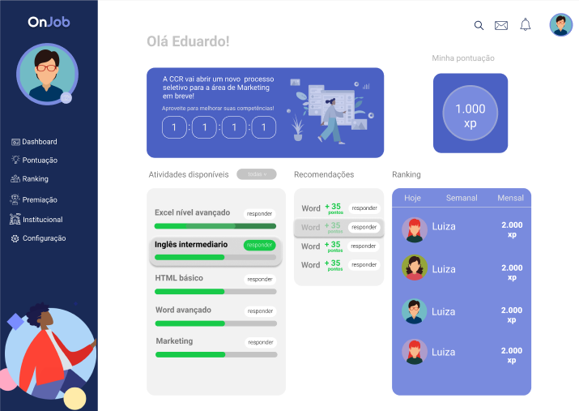

<p align="center">
  
<p>

<p align="center"> 
  
  
  <a href="https://github.com/USUÁRIO">
    
  </a>
  
<p>

<p align="center">
 <a href="#eye_speech_bubble-visualizar">Visualizar</a> •
 <a href="#information_source-sobre">Sobre</a> •
 <a href="#arrow_forward-executar">Executar</a> •
 <a href="#hammer_and_wrench-tecnologias">Tecnologias</a> •
 <a href="#balance_scale-licença">Licença</a>
</p>

---
## :eye_speech_bubble: **Visualizar**

<div align="center">

### :desktop_computer: Computador
  
|Desktop|
|:---:|
|<kbd></kbd>|

</div>
  
---
## :information_source: Sobre

On Job - Plataforma gamificada para jovens de 16 à 20 anos, onde estes irão responder testes de conhecimento em diversas áreas e receber premiações (em dinheiro ou não) de acordo com seu nível de acertos e participação.

Os resultados destes testes poderão ser vistos por empresas parceiras, que assim como os jovens terão um perfil de acesso na mesma plataforma. A empresa também terá acesso a um completo banco de dados onde poderão filtrar esses jovens por ordem de competências que estão buscando para preenchimento de alguma vaga em aberto.

---
## :arrow_forward: **Executar**

Para executar esse projeto você precisa baixar este repositório, ter o Gerenciador de Pacotes do Node ([`NPM`](https://www.npmjs.com/get-npm)) ou o Gerenciador de Pacotes YARN ([`YARN`](https://yarnpkg.com/getting-started)) instalado.

### :desktop_computer: **WEB**

Abra o prompt de comando no diretório do projeto, abra a pasta do repositório e execute os seguintes códigos:

<details>
  <summary><i>com <b>npm</b></i></summary>
  
  ```bash
  # Instalar dependências
  $ npm install

  # Iniciar o servidor de desenvolvimento
  $ npm start
  ```
  
</details>

<details>
  <summary><i>com <b>yarn</b></i></summary>
  
  ```bash
  # Instalar dependências
  $ yarn

  # Iniciar o servidor de desenvolvimento
  $ yarn start

  ```

</details>

> ⚠️ O servidor de desenvolvimento será iniciado na porta: 3000 - Acesse <http://localhost:3000>

---
## :hammer_and_wrench: **Tecnologias**

As seguintes ferramentas foram utilizadas para desenvolver esse projeto:

<div align="center">

|:globe_with_meridians: Web|
|:---:|
|[HTML5](https://developer.mozilla.org/pt-BR/docs/Web/HTML/HTML5)|
|[CSS3](https://www.w3schools.com/css/)|
|[TypeScript](https://www.typescriptlang.org)|
|[React](https://reactjs.org)|
|[Styled Components](https://styled-components.com)|

</div>

---
## :balance_scale: **Licença**

<div align="center">

Copyright © 2021 [OnJob](https://github.com/rafaelfachinelli/OnJob).<br />
Este projeto é licenciado por [MIT](./LICENSE).

</div>
